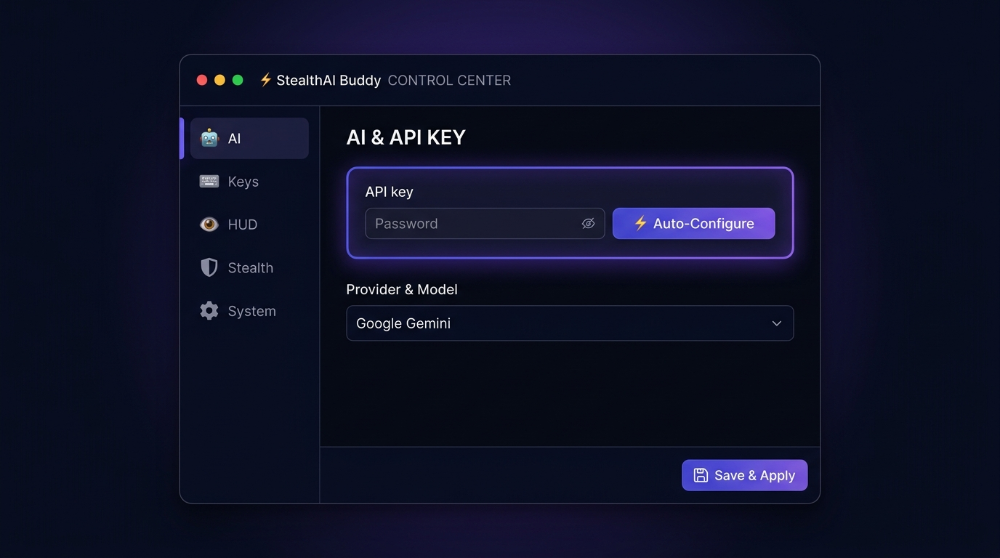
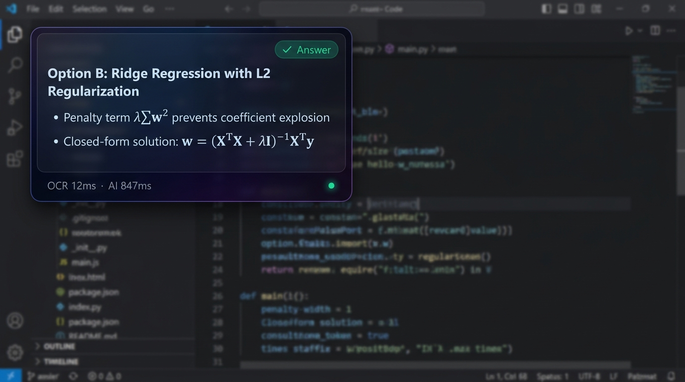
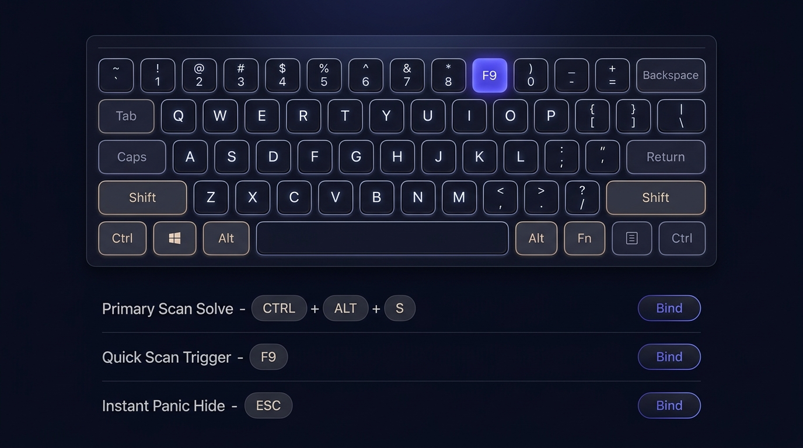

<div align="center">

# ⚡ StealthAI Buddy

**A luxury stealth AI overlay for Windows — invisible to screen sharing, powered by Gemini, OpenAI, or Claude.**


</div>

---

## 📸 Screenshots

### Control Center — AI & API Key Setup


### Stealth HUD Overlay — Live AI Answer


### Virtual Keyboard — Hotkey Binding


---

## ✨ Features

- **🛡 Fully Stealth** — Invisible to Zoom, Teams, Discord, OBS and all screen sharing via `WDA_EXCLUDEFROMCAPTURE`
- **🤖 Multi-Provider AI** — Gemini, OpenAI GPT-4o, Anthropic Claude, Ollama (local), custom endpoints
- **⚡ Instant Scan** — Press F9 or Ctrl+Alt+S to capture and solve anything on screen in seconds
- **🎨 7 Luxury HUD Themes** — Midnight Obsidian, Matrix Emerald, Cyberpunk Neon, Solar Amber, Nordic Frost, and more
- **⌨️ Virtual Keyboard Binding** — Interactive rendered keyboard for binding hotkeys visually
- **🔒 DPAPI Encrypted Keys** — API keys encrypted with Windows DPAPI (tied to your user + machine)
- **🪄 S1mple Stealth Mode** — Pure transparent text overlay, zero chrome, fully movable & resizable
- **💼 Disguised Process** — Appears as `Windows Desktop Window Helper Service` in Task Manager
- **🖥 Standalone EXE** — Single-file build, no Python required on target machine

---

## 🚀 Quick Start

### Option A — Use the pre-built EXE
Download `DesktopWindowHelper.exe` from [Releases](../../releases) and run it.

### Option B — Run from source

```bash
# 1. Install dependencies
pip install -r requirements.txt

# 2. Run
python main.py
```

---

## ⚙️ First-Time Setup

1. Press **Ctrl+Alt+O** to open the Control Center
2. Paste your API key in the **Universal API Key** field
3. Click **⚡ Auto-Configure** — it detects your provider and finds the best model automatically
4. Press **F9** to scan your screen and get an instant AI answer

### Supported API Keys
| Provider | Key Format |
|---|---|
| Google Gemini | `AIzaSy...` |
| OpenAI | `sk-...` |
| Anthropic Claude | `sk-ant-...` |
| Ollama (local) | `http://localhost:11434` |

---

## 🎮 Default Hotkeys

| Action | Hotkey |
|---|---|
| Scan & Solve | `F9` or `Ctrl+Alt+S` |
| Panic Hide | `Esc` |
| Repeat Last Answer | `Ctrl+Alt+R` |
| Open Settings | `Ctrl+Alt+O` |

All hotkeys are fully rebindable via the virtual keyboard in Settings → Keys.

---

## 🏗 Build EXE

```bash
python build_exe.py
# Output: dist/DesktopWindowHelper.exe
```

---

## 📁 Project Structure

```
StealthAI/
├── main.py                  # Entry point
├── build_exe.py             # PyInstaller build script
├── requirements.txt
└── stealth_buddy/
    ├── app.py               # Main controller
    ├── ai_engine.py         # Multi-provider AI client
    ├── overlay.py           # Stealth HUD overlay
    ├── settings_gui.py      # Control center UI + virtual keyboard
    ├── config.py            # Config manager + DPAPI encryption
    ├── capture.py           # Screen capture engine
    ├── hotkey_listener.py   # Global hotkey registration
    └── system_tray.py       # System tray manager
```

---

## 🛡 Stealth Features

| Feature | Details |
|---|---|
| Screen-share invisible | `SetWindowDisplayAffinity(WDA_EXCLUDEFROMCAPTURE)` |
| Click-through mode | `WS_EX_TRANSPARENT` extended style |
| Alt-Tab invisible | `WS_EX_TOOLWINDOW` flag |
| Taskbar hidden | Tool window mode |
| Process disguise | Renamed EXE + version metadata |
| API key encryption | Windows DPAPI (user+machine locked) |

---

## 📋 Requirements

```
PySide6>=6.6
mss>=9.0
Pillow>=10.0
requests>=2.31
openai>=1.0
anthropic>=0.20
keyboard>=0.13
```

---

## 📄 License

Copyright (c) 2026 StealthAI Buddy. All Rights Reserved. — see [LICENSE](LICENSE)

---

<div align="center">
Built with ⚡ for professionals who need answers fast.
</div>
