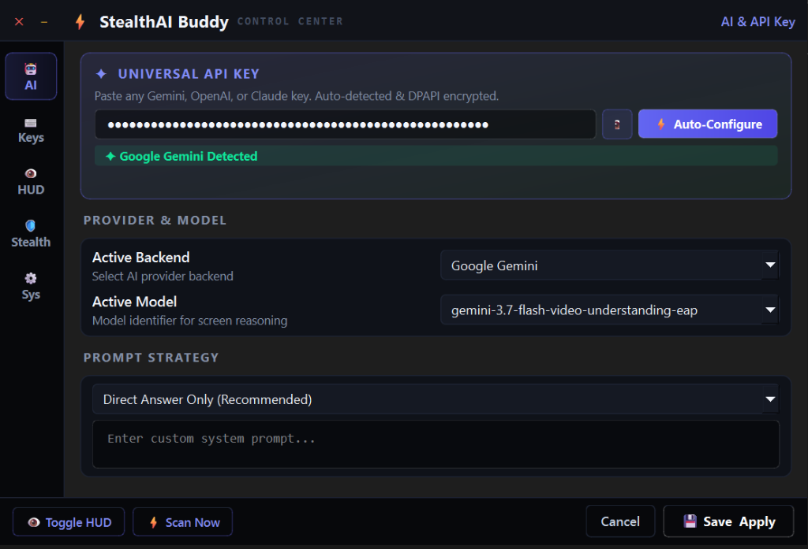
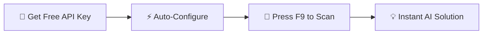
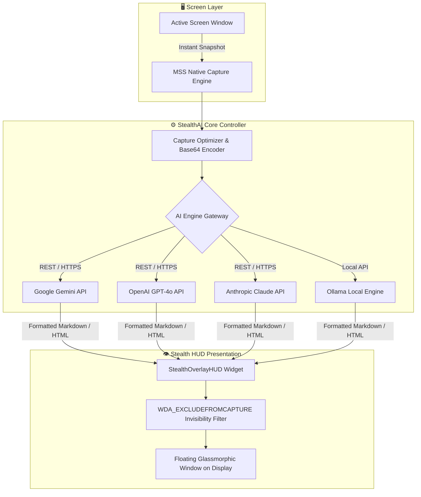

<div align="center">

# ⚡ StealthAI Buddy

### *Ultra-Low-Latency, Streamproof AI Copilot for Windows*

[](https://python.org)
[](https://pypi.org/project/PySide6/)
[](https://microsoft.com/windows)
[](https://aistudio.google.com)
[](https://openai.com)
[](https://anthropic.com)
[](LICENSE)

<br />

> **StealthAI Buddy** is a luxury, invisible overlay HUD engineered for developers and professionals. It silently captures your screen, reasons with state-of-the-art vision models (Gemini, GPT-4o, Claude), and displays answers in real time without appearing on Zoom, Microsoft Teams, Discord, or OBS screen shares.

<br />

---

</div>

## 📸 Live Software Interface

<div align="center">

| ⚡ Floating Stealth HUD Overlay | ⚙️ Control Center Settings |
| :---: | :---: |
|  |  |
| *Matrix Emerald Theme — Borderless floating text* | *DPAPI encrypted settings, themes & virtual keyboard* |

</div>

---

## ⚡ 60-Second Quick Start (100% Free Gemini API)



### Step 1: Get Your Free Gemini Key *(No Credit Card Needed)*
1. Head over to **[Google AI Studio (aistudio.google.com)](https://aistudio.google.com/app/apikey)**.
2. Sign in with your Google account.
3. Click **"Create API key"** → **"Create key in new project"**.
4. Copy your key (starts with `AIzaSy...`).

### Step 2: Auto-Configure StealthAI
1. Run **`DesktopWindowHelper.exe`** (or `python main.py`).
2. Press <kbd>Ctrl</kbd> + <kbd>Alt</kbd> + <kbd>O</kbd> to open the **Control Center**.
3. Paste your key in the **Universal API Key** field.
4. Click **`⚡ Auto-Configure`** — StealthAI auto-validates the connection, discovers active models, and saves it with DPAPI encryption.
5. Click **`💾 Save & Apply`**.

### Step 3: Scan Anything Instantly
- Press <kbd>F9</kbd> anywhere on Windows to analyze your current screen and display the answer!

---

## 🌟 Key Highlights & Features

<table>
  <tr>
    <td width="50%">
      <h3>🛡️ Hardware Streamproof Invisibility</h3>
      Uses native Windows <code>SetWindowDisplayAffinity(WDA_EXCLUDEFROMCAPTURE)</code>. Completely transparent to Zoom, Discord, MS Teams, OBS Studio, and Google Meet screen captures.
    </td>
    <td width="50%">
      <h3>🤖 Multi-Provider AI Engine</h3>
      Seamlessly swap between <b>Google Gemini</b> (Flash 2.0 / 2.5), <b>OpenAI</b> (GPT-4o), <b>Anthropic Claude</b> (3.5 Sonnet), or <b>Ollama</b> local offline LLMs.
    </td>
  </tr>
  <tr>
    <td width="50%">
      <h3>⌨️ Interactive Virtual Keyboard</h3>
      Visual QWERTY keyboard built directly into the settings dialog. Bind custom global hotkey combos with a single click.
    </td>
    <td width="50%">
      <h3>🔒 DPAPI Hardware Encryption</h3>
      All API keys are encrypted at rest using the Windows Data Protection API (DPAPI). Keys can only be decrypted by your specific Windows user account on your local machine.
    </td>
  </tr>
  <tr>
    <td width="50%">
      <h3>🪄 S1mple Stealth Mode</h3>
      Converts the HUD into a zero-chrome, 100% transparent text overlay. Freely draggable and resizable across multiple monitors.
    </td>
    <td width="50%">
      <h3>💼 Process Disguise</h3>
      Disguised in Windows Task Manager and Process Explorer as <code>Windows Desktop Window Helper Service</code> (<code>DesktopWindowHelper.exe</code>).
    </td>
  </tr>
</table>

---

## 🎮 Global Hotkey Cheat-Sheet

All triggers use native Win32 `RegisterHotKey` for zero-latency background execution:

| Action | Hotkey | Function |
| :--- | :---: | :--- |
| **Quick Screen Solve** | <kbd>F9</kbd> | Single-key instantaneous screen reasoning |
| **Primary Full Scan** | <kbd>Ctrl</kbd> + <kbd>Alt</kbd> + <kbd>S</kbd> | Standard multi-key capture and solve |
| **Instant Panic Hide** | <kbd>Esc</kbd> | Smoothly fades out the HUD in milliseconds |
| **Open Control Center** | <kbd>Ctrl</kbd> + <kbd>Alt</kbd> + <kbd>O</kbd> | Opens settings, themes, and keybindings |
| **Repeat Cached Answer** | <kbd>Ctrl</kbd> + <kbd>Alt</kbd> + <kbd>R</kbd> | Re-displays last solution with zero API latency |

---

## 🎨 Luxury HUD Themes

StealthAI Buddy comes packed with 7 handcrafted visual themes:

| Theme Name | Accent Color | Aesthetic & Mood |
| :--- | :---: | :--- |
| **Matrix Emerald** | `#10e599` 🟢 | Cyberpunk terminal glow with neon emerald highlights |
| **Midnight Obsidian** | `#818cf8` 🟣 | Deep space dark navy with indigo luminescence |
| **Cyberpunk Neon** | `#f43f5e` 🔴 | High-contrast neon rose with futuristic dark glass |
| **Solar Amber** | `#f59e0b` 🟡 | Warm gold-amber accents with sleek graphite background |
| **Nordic Frost** | `#38bdf8` 🔵 | Icy cyan glow on ultra-deep translucent obsidian |
| **Crimson Dark** | `#ff4d4d` 🔴 | Aggressive stealth red with subtle shadow gradients |
| **Vaporwave** | `#a855f7` 🟣 | Retro-wave purple and violet neon glassmorphism |

---

## 🏗 System Architecture & Workflow



---

## 📦 Standalone Binary Compilation

To build your own single-file portable executable with disguised metadata:

```powershell
# 1. Clone repository & enter workspace
git clone https://github.com/Dark-Shadow34/StealthAIBuddy.git
cd StealthAIBuddy

# 2. Install dependencies
pip install -r requirements.txt

# 3. Build standalone EXE
python build_exe.py
```

Output binary:
`dist/DesktopWindowHelper.exe`

---

## ❓ Frequently Asked Questions

<details>
<summary><b>Does this show up when I share my screen on Zoom, Teams, or Discord?</b></summary>
<br />
<b>No.</b> StealthAI Buddy uses the native Windows <code>SetWindowDisplayAffinity</code> API with the <code>WDA_EXCLUDEFROMCAPTURE</code> flag. Windows automatically removes the window from all desktop and window capture pipelines at the DWM (Desktop Window Manager) level.
</details>

<details>
<summary><b>Is the Google Gemini API really free?</b></summary>
<br />
<b>Yes.</b> Google AI Studio provides a free tier for Gemini 2.0 Flash and Flash-Lite models with up to 15 RPM (requests per minute) and 1,000,000 TPM (tokens per minute), which is completely free for personal use with no credit card required.
</details>

<details>
<summary><b>Where are my API keys stored?</b></summary>
<br />
Your keys are encrypted using the Windows DPAPI (<code>CryptProtectData</code>) and stored locally in <code>config.json</code>. They can never be decrypted by other users or transferred to other computers.
</details>

<details>
<summary><b>Can I change the screen position or size?</b></summary>
<br />
<b>Yes.</b> You can drag the HUD anywhere by holding left-click on the header, resize it by dragging the bottom-right corner, or switch to <b>S1mple Stealth Mode</b> for a pure borderless experience.
</details>

---

## 📄 License & Proprietary Rights

Copyright (c) 2026 StealthAI Buddy. **All Rights Reserved.**  
This software, source code, and assets are proprietary and confidential. Unauthorized copying, reverse engineering, redistribution, or modification is strictly prohibited. See [LICENSE](LICENSE) for terms.

<div align="center">
<br />
<b>⚡ StealthAI Buddy — Speed, Precision & Discretion</b>
</div>
