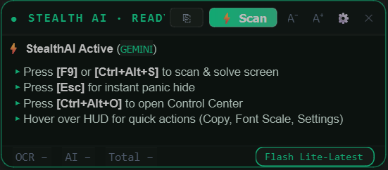

<div align="center">

# ⚡ StealthAI Buddy

**Ultra-Fast, Screen-Share Invisible AI Overlay for Windows — Powered by Google Gemini, OpenAI & Claude.**


</div>

---

## 📸 Real Software Preview

<div align="center">
  
  <p><em>Real live screenshot of StealthAI Buddy HUD floating invisibly on screen in Matrix Emerald theme.</em></p>
</div>

---

## ⚡ Quick Start Tutorial (100% Free Gemini API in 60s)

Follow these 4 simple steps to get started with zero cost:

### 1. Get Your Free Gemini API Key (No Credit Card Required)
1. Go to **[Google AI Studio](https://aistudio.google.com/app/apikey)**.
2. Sign in with any Google account.
3. Click the blue **"Create API key"** (or **"Get API key"**) button.
4. Select or create a project and click **"Create key in new project"**.
5. Copy your new API key (starts with `AIzaSy...`).

> 💡 **Tip:** Google gives you a generous free tier for Gemini Flash models (15 RPM / 1 million tokens per minute) which is completely free forever.

---

### 2. Configure StealthAI Buddy
1. Run `DesktopWindowHelper.exe` (or `python main.py`).
2. Press **`Ctrl + Alt + O`** on your keyboard (or click the ⚙️ gear icon on the HUD) to open the **Control Center**.
3. In the **Universal API Key** box, paste your key (`AIzaSy...`).
4. Click **`⚡ Auto-Configure`**:
   - StealthAI will automatically verify your key against Google's API.
   - It discovers all available models and auto-selects the fastest ultra-low-latency model (e.g. `gemini-2.0-flash` or `gemini-2.5-flash-lite`).
   - Your key is immediately DPAPI encrypted in local storage.
5. Click **`💾 Save & Apply`**.

---

### 3. Start Scanning & Solving
- **Instant Scan:** Press **`F9`** or **`Ctrl + Alt + S`** anytime.
  - The HUD immediately snaps a silent snapshot of your active display.
  - Returns the solution/reasoning directly in the stealth overlay.
- **Panic Hide:** Press **`Esc`** at any moment to instantly vanish the overlay.
- **Repeat Last Answer:** Press **`Ctrl + Alt + R`** to bring back the last cached solution without making a new API call.
- **Rebind Hotkeys:** Go to **Settings (Ctrl+Alt+O) → Keys** and click on any key on the interactive virtual keyboard to bind custom keys.

---

## ✨ Core Features

- **🛡 Streamproof Invisibility** — Invisible to Zoom, Microsoft Teams, Discord, OBS Studio, Slack, and Google Meet via hardware-level `WDA_EXCLUDEFROMCAPTURE`.
- **🤖 Multi-Provider AI Engine** — Native support for Google Gemini (Flash/Pro), OpenAI (GPT-4o / GPT-4o-mini), Anthropic Claude (Sonnet/Haiku), Ollama (Local offline models), or custom API endpoints.
- **⌨️ Interactive Virtual Keyboard** — Beautiful QWERTY visual keyboard in settings for 1-click custom hotkey binding.
- **🪄 S1mple Stealth Mode** — Toggleable borderless pure-text HUD mode with zero window chrome for ultimate discretion.
- **🔒 Military-Grade DPAPI Encryption** — API keys are encrypted at rest using Windows Data Protection API (tied strictly to your Windows user identity).
- **🎨 7 Luxury Themes** — Matrix Emerald, Midnight Obsidian, Cyberpunk Neon, Solar Amber, Nordic Frost, Crimson Dark, and Vaporwave.
- **💼 Process Disguise** — Disguised in Windows Task Manager and Process Explorer as `Windows Desktop Window Helper Service` (`DesktopWindowHelper.exe`).
- **📦 Single-File Standalone EXE** — Fully self-contained portable executable with zero external runtime dependencies.

---

## 🎮 Hotkey Reference

| Action | Default Hotkey | Description |
|---|---|---|
| **Quick Scan** | `F9` | Single-key instant screenshot reasoning |
| **Primary Scan** | `Ctrl + Alt + S` | Standard multi-key capture & solve |
| **Panic Hide** | `Esc` | Instantly fades out the HUD overlay |
| **Open Settings** | `Ctrl + Alt + O` | Opens the full Control Center |
| **Repeat Answer** | `Ctrl + Alt + R` | Re-displays last cached AI response |

---

## 🏗 Building From Source

If you want to build the standalone `.exe` yourself:

```powershell
# 1. Install required packages
pip install -r requirements.txt

# 2. Compile standalone disguised binary
python build_exe.py
```
The compiled single-file binary will be generated at:
`dist/DesktopWindowHelper.exe`

---

## 📁 Repository Structure

```
StealthAIBuddy/
├── main.py                  # Entry point
├── build_exe.py             # Standalone PyInstaller builder
├── requirements.txt         # Dependencies
├── docs/
│   └── screenshots/         # Real UI assets
└── stealth_buddy/
    ├── app.py               # Main application orchestration & threading
    ├── ai_engine.py         # Multi-provider AI reasoning client & auto-discovery
    ├── overlay.py           # Streamproof stealth HUD with custom themes
    ├── settings_gui.py      # Control Center dialog & virtual keyboard
    ├── config.py            # DPAPI encrypted configuration manager
    ├── capture.py           # Low-latency screen capture engine
    ├── hotkey_listener.py   # Global Win32 hotkey filtering
    └── system_tray.py       # Notification tray manager
```

---

## 📄 License & Terms

Copyright (c) 2026 StealthAI Buddy. All Rights Reserved.  
This software and its source code are proprietary and confidential. Unauthorized copying, reverse engineering, redistribution, or modification is strictly prohibited. See [LICENSE](LICENSE) for details.
